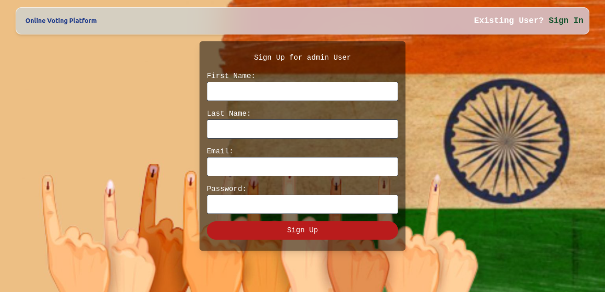

# Online-Voting-Platform
Online Voting Platform built using Node.js and express.js

* Empowering administrators to manage elections effortlessly, ensuring security and accessibility.
* Real-time results and graphical representations enhance transparency and decision-making.
* Committed to providing an intuitive platform for administrators to oversee elections with ease.

# Application Link:
https://online-voting-platform-t8sr.onrender.com/

# Demo Video:
https://www.loom.com/share/f6d7023c065041a9b7e2088391815ddf?sid=40cfcd50-bf20-4320-af5a-3cdbec43d186

# Application Glimpse:

